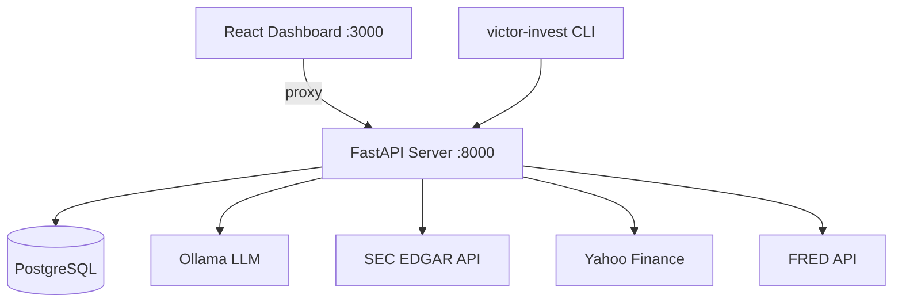

# Deployment Guide

## Architecture Overview



## Docker Compose

The provided `docker-compose.yml` defines the full stack:

| Service | Image | Port | Purpose |
|---------|-------|------|---------|
| `app` | victor-invest | 8000 | FastAPI + React UI |
| `postgres` | postgres:16-alpine | 5432 | Primary database |
| `redis` | redis:7-alpine | 6379 | Cache + job queue |
| `ollama` | ollama/ollama | 11434 | LLM inference |

```bash
# Start all services
docker compose up -d

# View logs
docker compose logs -f app

# Stop
docker compose down
```

## Environment Variables

Copy `config/.env.example` to `.env` and configure:

### Required

| Variable | Description |
|----------|-------------|
| `DATABASE_URL` | PostgreSQL connection string |
| `SEC_EMAIL` | Email for SEC EDGAR user-agent header |

### Optional

| Variable | Default | Description |
|----------|---------|-------------|
| `OLLAMA_HOST_1` | `http://localhost:11434` | Primary Ollama endpoint |
| `REDIS_URL` | `redis://localhost:6379` | Redis connection string |
| `ANALYSIS_DEFAULT_MODE` | `standard` | Default analysis mode |
| `BATCH_ANALYSIS_MAX_PARALLEL` | `4` | Max concurrent batch analyses |

## Production Considerations

### Database
- Use PostgreSQL 14+ with at least 1 GB storage for SEC filings cache
- Run migrations: `alembic upgrade head`
- The `--process-raw` flag on cache warm reprocesses raw SEC filings

### LLM
- Ollama must have at least one model pulled (`llama3.2` recommended)
- Multi-server load balancing: set `OLLAMA_HOST_1`, `OLLAMA_HOST_2`, etc.
- VRAM calculator auto-selects batch sizes based on available GPU memory

### Scheduled Jobs
- Use `config/scheduler.yaml` to define cron jobs
- Generate system crontab: `python scripts/scheduled/generate_crontab.py`
- Key jobs: SEC filing refresh, market regime update, macro indicators

### Monitoring
- Prometheus metrics at `/metrics`
- Health check at `/health`
- OpenTelemetry tracing (configure with `OTEL_EXPORTER_*` env vars)

## Frontend Build

```bash
cd frontend
npm install
npm run build      # outputs to frontend/dist/
```

The API server automatically serves `frontend/dist/index.html` at `/ui` when the build exists, falling back to the legacy `dashboard.html`.
