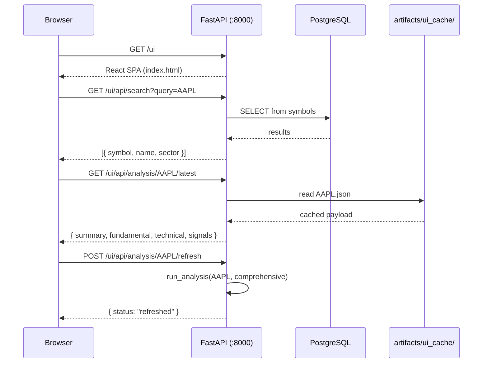

# UI Dashboard

The Victor Research Dashboard provides a browser-based interface for symbol lookup, analysis review, and portfolio rankings.

## Starting the Dashboard

```bash
victor-invest serve --host 0.0.0.0 --port 8000
```

Open [http://localhost:8000/ui](http://localhost:8000/ui).

## Data Flow



## API Endpoints

| Method | Path | Description |
|--------|------|-------------|
| `GET` | `/ui` | Serve dashboard SPA |
| `GET` | `/ui/api/search?query=&limit=20` | Symbol autocomplete search |
| `GET` | `/ui/api/analysis/{symbol}/latest` | Latest cached analysis |
| `POST` | `/ui/api/analysis/{symbol}/refresh` | Trigger fresh analysis |
| `GET` | `/ui/api/chart/{symbol}?days=180` | OHLCV + technical chart data |
| `GET` | `/ui/api/history` | Recent analysis history |
| `GET` | `/ui/api/rankings?top_n=20` | Portfolio rankings |
| `GET` | `/ui/api/rankings/export.csv` | Export rankings as CSV |

## Dashboard Tabs

### Summary
Shows the investment thesis at a glance: action recommendation, composite score, fair value gauge, key signals, and target return.

### Fundamental
Displays all valuation model results (DCF, P/E, P/S, EV/EBITDA, GGM, sector-specific), forward guidance notes, and raw JSON for debugging.

### Technical
Shows trend indicators, RSI, MACD, support/resistance levels, and a sortable metrics table.

### Charts
Four-panel view: candlestick price chart, volume with on-balance volume overlay, MACD histogram, and RSI oscillator. Configurable lookback period (30/90/180/365 days).

### Rankings
Portfolio construction view with longs/shorts tables, sector-neutral pairs, pair trade suggestions, and CSV export.

## Symbol Search

- Database-backed: queries the `symbols` table for ticker, company name, sector, and industry
- Fallback: if the database is unavailable, reads `data/sector_industry_ticker_map.txt`
- Debounced: 300ms delay before querying

## Caching

Analysis results are cached in `artifacts/ui_cache/{SYMBOL}.json`. The dashboard reads cached data for fast loading. Use the "Refresh" button or `POST /ui/api/analysis/{symbol}/refresh` to regenerate.

## Notes

- The UI does not replace CLI scheduling or background refresh jobs — it is an additional read/refresh surface
- For development, run `make run-dev` and open `http://localhost:8000/ui`
- The React frontend (when built) is served from `frontend/dist/`; if not present, falls back to the legacy `dashboard.html`
