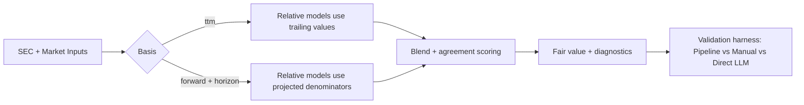
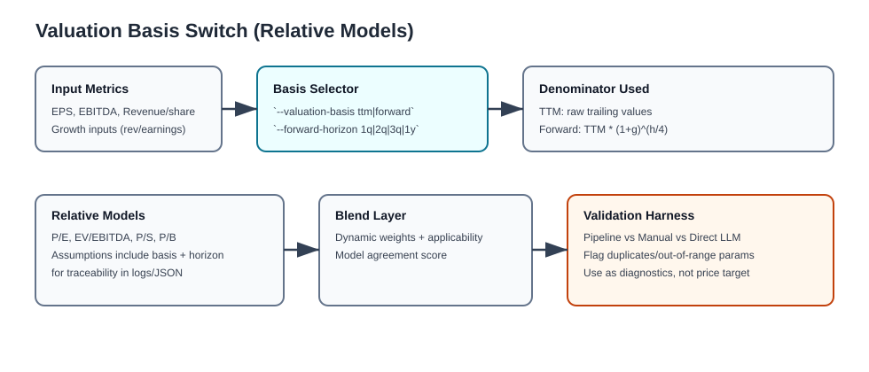

# Valuation Playbook (TTM vs Forward)

> [!IMPORTANT]
> This is the operator-facing valuation doc. Keep this file concise and executable.

## 1) Decision Map





## 2) Runtime Mode Matrix

| CLI Path | Supports basis switch | Command |
|---|---|---|
| `victor-invest` | No (today) | `victor-invest analyze STX --mode comprehensive` |
| `cli_orchestrator.py` (legacy runtime) | Yes | `INVESTIGATOR_LEGACY=1 python cli_orchestrator.py analyze STX -m comprehensive --valuation-basis forward --forward-horizon 1y` |

> [!WARNING]
> `--valuation-basis` and `--forward-horizon` are currently wired through legacy orchestrator execution (`INVESTIGATOR_LEGACY=1`).

## 3) Basis Math

```text
Forward denominator factor = (1 + g)^(h/4)
h ∈ {1q=1, 2q=2, 3q=3, 1y=4}
g = earnings/revenue growth input (normalized and clamped in code)
```

Applied to relative model denominators:

| Model | Denominator |
|---|---|
| P/E | EPS |
| EV/EBITDA | EBITDA |
| P/S | Revenue per share |
| P/B | Book value per share (metadata-tagged basis) |

## 4) STX Validation Snapshot

### 4.1 Baseline TTM run (2026-02-12)

Source log: `artifacts/logs/stx_comprehensive_run_20260212_fix17_noise_cleanup.log`

| Metric | Value |
|---|---:|
| Blended fair value | `$218.84` |
| DCF | `$186.93` |
| P/E | `$245.71` |
| EV/EBITDA | `$188.46` |
| P/S | `$326.63` |

### 4.2 Forward horizon runs (2026-02-13)

Source logs:
- `artifacts/logs/stx_comprehensive_run_20260213_forward_1q.log`
- `artifacts/logs/stx_comprehensive_run_20260213_forward_2q.log`
- `artifacts/logs/stx_comprehensive_run_20260213_forward_3q.log`
- `artifacts/logs/stx_comprehensive_run_20260213_forward_1y.log`

| Horizon | Blended | DCF | P/E | EV/EBITDA | P/S |
|---|---:|---:|---:|---:|---:|
| 1q | `$231.43` | `$194.42` | `$262.52` | `$202.47` | `$344.13` |
| 2q | `$242.17` | `$194.42` | `$280.48` | `$217.43` | `$367.68` |
| 3q | `$253.63` | `$194.42` | `$299.67` | `$233.41` | `$392.83` |
| 1y | `$265.89` | `$194.42` | `$320.17` | `$250.49` | `$419.71` |

## 5) Systematic Cross-check (8 symbols)

Source:
- `artifacts/reports/systematic_pipeline_vs_manual_vs_llm_20260212_184826.md`
- `artifacts/reports/systematic_pipeline_vs_manual_vs_llm_20260212_184826.json`

| Metric | Pipeline | Manual | Direct LLM |
|---|---:|---:|---:|
| Median abs error vs price | `48.1%` | `38.2%` | `8.0%` |
| Mean abs error vs price | `42.8%` | `39.9%` | `12.7%` |

Flagged diagnostics:
- Repeated direct-LLM fair value across symbols (duplicate outputs detected).
- Invalid direct-LLM discount-rate scale found in at least one case (`8.50`).

> [!CAUTION]
> Direct-LLM closeness to current price is not a correctness proof. Treat as a comparator signal, not a primary source of truth.

## 6) Execution Cards

### 6.1 Run and log

```bash
mkdir -p artifacts/logs
source ~/.investigator/env
INVESTIGATOR_LEGACY=1 python cli_orchestrator.py analyze STX -m comprehensive \
  --valuation-basis forward --forward-horizon 1y \
  > artifacts/logs/stx_comprehensive_run_$(date +%Y%m%d)_forward_1y.log 2>&1
```

### 6.2 Compare pipeline vs manual vs direct LLM

```bash
python scripts/compare_cached_manual_valuation.py --symbol STX --market-source auto
```

### 6.3 Horizon sweep

```bash
for h in 1q 2q 3q 1y; do
  INVESTIGATOR_LEGACY=1 python cli_orchestrator.py analyze STX -m comprehensive \
    --valuation-basis forward --forward-horizon "$h" \
    > "artifacts/logs/stx_comprehensive_run_$(date +%Y%m%d)_forward_${h}.log" 2>&1
done
```

## 7) Guardrails

> [!TIP]
> Use `ttm` for trailing-quality checks and `forward` for target-horizon valuation narratives.

> [!WARNING]
> Do not compare runs with different refresh modes (`--force-refresh` vs cached) as if they were like-for-like.

