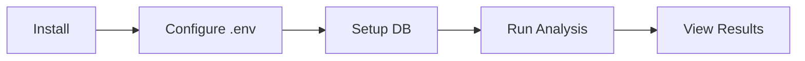
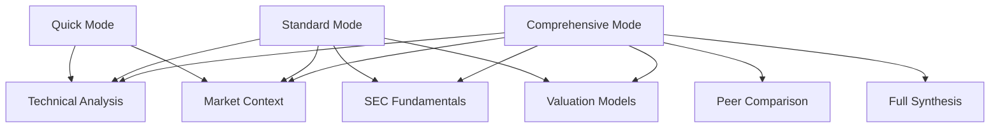

# Getting Started with Victor-Invest

## Prerequisites

- Python 3.11+
- PostgreSQL 14+ (or SQLite for development)
- 8 GB RAM recommended

## Installation

```bash
git clone https://github.com/anvai-labs/victor-invest.git
cd victor-invest
python -m venv venv && source venv/bin/activate
pip install -e ".[dev,viz]"
cp config/.env.example .env
# Edit .env with your database credentials
```

## Configuration

Victor-Invest reads settings from `config.yaml` (with `${ENV_VAR:-default}` substitution) and `.env`.

Key variables:

| Variable | Purpose | Default |
|----------|---------|---------|
| `DATABASE_URL` | PostgreSQL connection string | `postgresql://localhost/investigator` |
| `OLLAMA_HOST_1` | Primary Ollama server | `http://localhost:11434` |
| `SEC_EMAIL` | SEC EDGAR user-agent email | (required) |

## Database Setup

```bash
# SQLite (development/testing)
python -m investigator.infrastructure.database.installer --sqlite investigator.db

# PostgreSQL (production)
python -m investigator.infrastructure.database.installer --postgres $DATABASE_URL
```

## First Analysis



```bash
# Quick analysis — technical + market context only
victor-invest analyze AAPL --mode quick

# Standard analysis — includes SEC fundamentals
victor-invest analyze MSFT --mode standard

# Full synthesis with peer comparison
victor-invest analyze GOOGL --mode comprehensive
```

## Viewing Results in the Dashboard

```bash
# Start the API server
victor-invest serve --host 0.0.0.0 --port 8000
```

Open [http://localhost:8000/ui](http://localhost:8000/ui) in your browser.

## Analysis Modes



| Mode | Agents | Speed | Detail |
|------|--------|-------|--------|
| Quick | Technical, Market Context | ~30s | Price action + sentiment |
| Standard | + SEC, Valuation | ~2min | Full fundamental analysis |
| Comprehensive | + Peer, Synthesis | ~5min | Complete investment thesis |

## Next Steps

- [CLI Commands Reference](CLI_DATA_COMMANDS.md)
- [Architecture Guide](ARCHITECTURE.md)
- [Valuation Models](VALUATION_ASSUMPTIONS.md)
- [Dashboard Guide](UI_DASHBOARD.md)
- [Operations Runbook](OPERATIONS_RUNBOOK.md)
