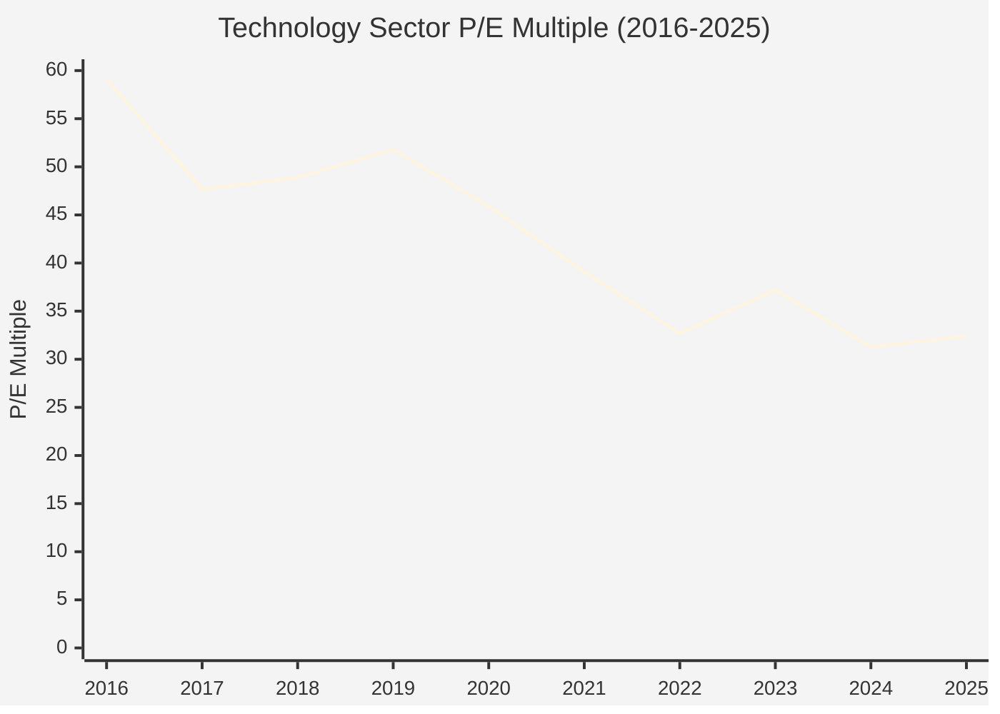

# Visualization Guide for Sector Analysis Charts

## Quick Start: Opening HTML Files

### Option 1: Direct Browser Opening (Recommended for Local Use)

Simply double-click the HTML files or open them in your browser:

```bash
# macOS
open docs/assets/sector_trends.html
open docs/assets/sector_insights_enhanced.html

# Linux
xdg-open docs/assets/sector_trends.html

# Windows (WSL/Git Bash)
start docs/assets/sector_trends.html
```

### Option 2: Simple HTTP Server (Recommended for Sharing)

```bash
# From the repo root
python3 -m http.server 8000

# Then open: http://localhost:8000/docs/assets/sector_trends.html
```

### Option 3: VS Code Live Server Extension

1. Install "Live Server" extension in VS Code
2. Right-click HTML file → "Open with Live Server"
3. Auto-reloads on changes

---

## GitHub Rendering Options

### Problem: GitHub doesn't render interactive HTML charts

GitHub Pages can host HTML, but the interactive Chart.js visualizations won't work in the repo file view.

### Solutions:

#### Option A: GitHub Pages (Best for Public Sharing)

```bash
# 1. Create gh-pages branch
git checkout --orphan gh-pages
git filter-branch --subdirectory-filter docs/assets --prune-empty .

# 2. Push to GitHub
git push origin gh-pages

# 3. Enable GitHub Pages in repo settings
# Settings → Pages → Source: gh-pages branch
```

Then access at: `https://username.github.io/victor-invest/sector_trends.html`

#### Option B: Static Export to SVG (Best for Documentation)

Convert the interactive charts to static SVG images for embedding in markdown:

```bash
# Install node-puppeteer for headless Chrome
npm install -g puppeteer-cli

# Or use Python with selenium
pip install selenium pyvirtualdisplay
```

Create a conversion script:

```python
# scripts/export_charts_to_svg.py
import asyncio
from pyppeteer import launch
import os

async def html_to_svg(html_path, svg_path):
    browser = await launch(headless=True)
    page = await browser.newPage()
    await page.goto(f'file://{os.path.abspath(html_path)}')
    await page.waitForSelector('canvas', timeout=5000)

    # Get the chart data and render as SVG
    chart_data = await page.evaluate('() => charts')

    # Create SVG version
    svg_content = generate_svg_from_chart(chart_data)

    with open(svg_path, 'w') as f:
        f.write(svg_content)

    await browser.close()

if __name__ == '__main__':
    asyncio.get_event_loop().run_until_complete(
        html_to_svg('docs/assets/sector_trends.html', 'docs/assets/sector_trends.svg')
    )
```

#### Option C: Export as PNG Images (Simplest)

Use a browser screenshot service or Puppeteer:

```javascript
// screenshot_charts.js
const puppeteer = require('puppeteer');

(async () => {
  const browser = await puppeteer.launch();
  const page = await browser.newPage();
  await page.goto('file:///path/to/sector_trends.html');
  await page.waitForSelector('canvas');

  // Screenshot each chart
  const charts = await page.$$('canvas');
  for (let i = 0; i < charts.length; i++) {
    await charts[i].screenshot({ path: `chart_${i}.png` });
  }

  await browser.close();
})();
```

#### Option D: Mermaid Diagrams (Alternative for Documentation)

Convert key charts to Mermaid for markdown rendering:



---

## File Viewers Comparison

| Method | Interactivity | GitHub Support | Offline Use | Setup Effort |
|--------|--------------|----------------|-------------|--------------|
| **Direct Browser** | ✅ Full | ❌ No | ✅ Yes | ⭐ None |
| **HTTP Server** | ✅ Full | ❌ No | ✅ Yes | ⭐ One command |
| **GitHub Pages** | ✅ Full | ✅ Yes | ❌ No | ⭐⭐ Medium |
| **SVG Export** | ❌ Static | ✅ Yes | ✅ Yes | ⭐⭐⭐ Complex |
| **PNG Export** | ❌ Static | ✅ Yes | ✅ Yes | ⭐⭐ Medium |
| **Mermaid** | ❌ Static | ✅ Yes | ✅ Yes | ⭐⭐ Low |

---

## Recommended Workflow

### For Local Development
Use direct browser opening or simple HTTP server:
```bash
python3 -m http.server 8000
```

### For Documentation in GitHub
Convert key insights to static ASCII diagrams (already done in `visual_guide_complete_market_cycle.md`)

### For Public Sharing
Set up GitHub Pages or use the existing interactive HTML files with a web server

---

## Current Files

| File | Size | Content | Best For |
|------|------|---------|----------|
| `sector_trends.html` | 22KB | Line charts (P/E, P/S, P/B) | Local viewing |
| `sector_insights_enhanced.html` | 34KB | Line + scatter plots | Local viewing |
| `visual_guide_complete_market_cycle.md` | 18KB | ASCII diagrams | GitHub/docs |

---

## Git Visualization Commands

### View HTML in Git

```bash
# View raw HTML
git show HEAD:docs/assets/sector_trends.html

# Check differences
git diff HEAD~1 docs/assets/sector_trends.html
```

### Generate Diff Visualizations

```bash
# Side-by-side comparison
git diff --color-words HEAD~1 docs/assets/sector_trends.html

# With pager
git diff --paginate HEAD~1 docs/assets/*.html
```

---

## Quick Reference

```bash
# Open in browser (macOS)
open docs/assets/sector_trends.html

# Start local server
python3 -m http.server 8000

# View on GitHub Pages (after setup)
# https://username.github.io/victor-invest/sector_trends.html

# Check file status
git status docs/assets/*.html

# View git log for changes
git log --oneline docs/assets/*.html
```

---

## Summary

**For immediate use:** Open HTML files directly in your browser - they're self-contained now.

**For GitHub display:** The ASCII diagrams in `visual_guide_complete_market_cycle.md` render properly on GitHub.

**For sharing:** Set up GitHub Pages or use a simple HTTP server for others to view the interactive charts.

**For static docs:** Use the existing markdown visualizations or convert to PNG/SVG if needed.
