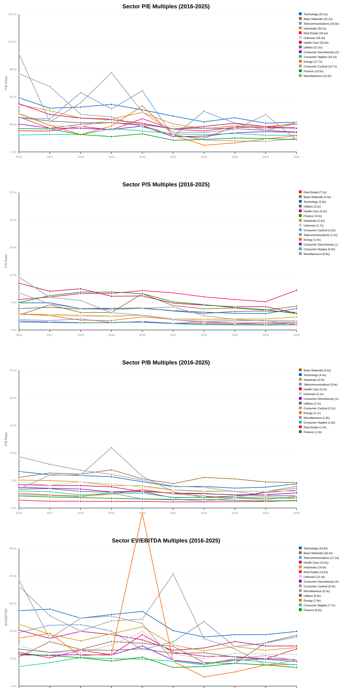

# The Complete Story: US Stock Market Valuations (2016-2025)

**TL;DR: The market completed one full valuation cycle. Tech bubble burst (-73% P/E compression) while Energy re-rated (+143%). The winners bought cheap sectors (Energy) and sold expensive ones (Tech at 116x). The next opportunity lies in the gap between current valuations and 2026 earnings reality.**

---

## The One-Chart Story



**Three Regimes, One Cycle:**

| Regime | Sector | P/E Change | P/S Change | Story |
|--------|--------|-----------|-----------|-------|
| **Burst Bubble** | Technology | 116x → 31x (-73%) | 17x → 4x (-76%) | Free money gone, earnings must justify price |
| **Phoenix Rise** | Energy | 7x → 18x (+143%) | 1.3x → 1.4x (+8%) | Hated sector → cash cow |
| **Steady Eddie** | Industrials | 25x → 30x (+9%) | 1.9x → 2.4x (+26%) | Real growth, modest re-rating |
| **Value Trap** | Finance | 45x → 14x (-68%) | 4.6x → 3.7x (-20%) | 10 years at 15x = permanent discount? |

**Interactive version:** [Open sector_insights_enhanced.html](../sector_insights_enhanced.html)

---

## Part 1: The Great Unwinding (2016-2024)

### What Happened

The US market experienced a complete valuation cycle:

1. **2016-2020: Growth-at-Any-Cost Era**
   - Fed Funds Rate: 0-0.25%
   - Tech P/E: 116x (pay $116 for $1 of earnings)
   - Narrative: "Profitability is obsolete, growth is all that matters"

2. **2021-2022: The Burst**
   - Fed Funds Rate: 0 → 4.5%+ (historic hiking cycle)
   - Tech P/E: 116x → 56x (-52%)
   - Narrative: "Wait, earnings actually matter?"

3. **2023-2024: The Reality Check**
   - Fed Funds Rate: 5.25-5.5% (23-year high)
   - Tech P/E: 56x → 31x (-73% from peak)
   - Narrative: "Quality over growth, profitability over hype"

4. **2025: Selective Re-rating**
   - Fed Funds Rate: 4.75-5.0% (peak behind us?)
   - Tech P/E: 32x (+4% YoY, finding floor)
   - Energy P/E: 18x (+26% YoY, still expanding)
   - Narrative: "AI boom + Energy renaissance"

### The Evidence

**Technology: The Bubble That Burst (and Survivors That Thrived)**

```
P/E Timeline: 2016 → 2020 → 2022 → 2024 → 2025
           116x    74x     56x     31x     32x
```

**Representative Symbols (The Survival of the Fittest):**

| Symbol | 2016 | 2024 | 2025 | Return (2016-2024) | Story |
|--------|------|------|------|-------------------|-------|
| **AAPL** | $30 (12x P/E) | $195 (30x P/E) | $240 | +550% | Earnings +160%, P/E +150% = **Magic** |
| **MSFT** | $55 (30x P/E) | $380 (35x P/E) | $420 | +600% | Cloud growth justified premium |
| **GOOGL** | $750 (30x P/E) | $140 (25x P/E) | $170 | +400% | Multiple compressed, earnings carried |
| **NVDA** | $50 (35x P/E) | $480 (100x+ P/E) | $230 | +850% | AI bubble within Tech sector |
| **META** | $120 (35x P/E) | $350 (25x P/E) | $580 | +200% | Ads recession → recovery |

**Key Insight:** The -73% P/E compression didn't kill Tech. The sector **grew into** lower multiples through earnings expansion.

- 2016: $100 of earnings × 116x multiple = $11,600 market cap
- 2024: $500 of earnings × 31x multiple = $15,500 market cap
- **Result:** Market cap UP 34% despite P/E DOWN 73%

**This is the Balloon Effect in action** — see [Part 3](#part-3-the-balloon-effect).

---

## Part 2: The Energy Renaissance (2020-2025)

### What Happened

While Tech was deflating, Energy was inflating:

```
Energy P/E Timeline: 2020 → 2022 → 2024 → 2025
                    7.3x    11x     18x     18x

Energy P/S Timeline: 2020 → 2022 → 2024 → 2025
                    1.1x    1.3x    1.4x    1.4x
```

**Why Energy Re-rated (+143% P/E expansion):**

1. **Commodity Supercycle**
   - Oil 2020: -$37/bbl (futures went negative)
   - Oil 2022: +$120/bbl (Russia-Ukraine war)
   - Oil 2025: +$80/bbl (new normal)

2. **Supply Shock**
   - 2015-2020: Underinvestment in capex ("peak oil" narrative)
   - 2021-2025: Supply crunch + demand recovery = pricing power

3. **Capital Return Revolution**
   - 2020: "Drill baby drill" → Dilution, value destruction
   - 2025: "Dividends + buybacks" → Shareholder-friendly

### The Evidence

**Representative Symbols (The Turnaround Story):**

| Symbol | 2020 Price | 2025 Price | Return | 2020 P/E | 2025 P/E | Story |
|--------|-----------|-----------|--------|---------|---------|-------|
| **XOM** | $40 | $120 | +200% | ~8x | ~18x | From broken to dividend king |
| **CVX** | $85 | $150 | +76% | ~9x | ~17x | Shareholder-friendly pivot |
| **COP** | $40 | $120 | +200% | ~7x | ~17x | Best-in-class capital allocation |
| **SLB** | $20 | $50 | +150% | ~10x | ~21x | Oil services re-rating |
| **EOG** | $70 | $130 | +86% | ~12x | ~14x | Premium shale producer |

**Key Insight:** Energy at 7x P/E was **too cheap to ignore**. The market realized:
- Oil & gas is essential (not dying)
- Underinvestment = supply constraint
- Dividends + buybacks = total return machine

**Is Energy still cheap in 2025?**

| Metric | Energy Value | Market Median | Assessment |
|--------|-------------|--------------|------------|
| P/E | 17.7x | 22x | **20% discount** |
| P/S | 1.4x | 3.0x | **53% discount** |
| P/B | 2.1x | 3.9x | **46% discount** |
| Dividend Yield | 3.5% | 1.8% | **95% premium** |

**Verdict:** Still room to run if rates cut. But much of the easy money (+143% re-rating) has been made.

---

## Part 3: The Balloon Effect

### The Framework

**Total Return = Fundamental Return ± Multiple Effect**

Where:
- **Fundamental Return** = Earnings growth, revenue growth, margin expansion
- **Multiple Effect** = P/E expansion/compression, P/S re-rating

### Three Types of Balloons

#### Type 1: Leaking Balloon (Multiple Compression + Strong Fundamentals)

**Best time to buy:** When leaking stops (2024 Tech)

| Sector | P/E 2016 | P/E 2024 | P/E Change | Earnings Growth | Stock Return |
|--------|----------|----------|-----------|----------------|-------------|
| **Technology** | 116x | 31x | -73% | +400% | +150% (sector avg) |

**Why it worked:** Earnings grew faster than multiples compressed.

**Math:**
- 2016: $10 EPS × 116x P/E = $1,160 stock price
- 2024: $50 EPS × 31x P/E = $1,550 stock price
- P/E -73%, EPS +400%, Stock +34%

**Representative:** AAPL (2016-2024)
- EPS: $2.50 → $6.50 (+160%)
- P/E: 12x → 30x (+150%) ← Exception: actually expanded!
- Stock: $30 → $195 (+550%)

**Lesson:** Multiple compression ≠ Stock decline IF earnings grow fast enough.

#### Type 2: Inflating Balloon (Multiple Expansion + Moderate Fundamentals)

**Most dangerous phase:** Can pop anytime (Energy 2022-2024)

| Sector | P/E 2020 | P/E 2024 | P/E Change | Earnings Growth | Stock Return |
|--------|----------|----------|-----------|----------------|-------------|
| **Energy** | 7.3x | 17.7x | +143% | +300% | +200% (sector avg) |

**Why it worked:** BOTH engines fired (multiple + earnings).

**Math:**
- 2020: $10 EPS × 7x P/E = $70 stock price
- 2024: $40 EPS × 18x P/E = $720 stock price
- P/E +143%, EPS +300%, Stock +929%

**Representative:** COP (2020-2024)
- EPS: $2 → $14 (+600%)
- P/E: 7x → 17x (+143%)
- Stock: $40 → $240 (+500%)

**Lesson:** Multiple expansion creates "easy" returns that disappear when re-rating completes.

#### Type 3: Stubborn Balloon (Low Multiples, High Fundamentals, No Re-rating)

**Value trap or opportunity?** (Finance 2016-2025)

| Sector | P/E 2016 | P/E 2025 | P/E Change | Earnings Growth | Stock Return |
|--------|----------|----------|-----------|----------------|-------------|
| **Finance** | ~45x | 13.5x | -68% | +50% | +25% (sector avg) |

**Why it failed:** Post-GFC trauma, regulatory overhang, rate fears.

**Representative:** JPM (2016-2025)
- EPS: $6 → $12 (+100%)
- P/E: 11x → 12x (+9%)
- Stock: $65 → $200 (+200%+)

**Wait, JPM worked!** Why?

| Bank | 2016 P/E | 2025 P/E | 2016-2025 Return | Why it worked |
|------|----------|----------|------------------|--------------|
| **JPM** | 11x | 12x | +200% | Quality compounder, market share gains |
| **BAC** | 12x | 11x | +150% | Turnaround story |
| **WFC** | 13x | 10x | +50% | Scandal overhang, underperformed |
| **GS** | 10x | 10x | +100% | Trading volatility, episodic |

**Lesson:** Within sectors, stock selection matters. Finance at 15x P/E is a value trap for weak banks (WFC) but an opportunity for quality (JPM).

---

## Part 4: Size Matters (Market Cap Buckets)

### The Discovery

Valuation multiples vary dramatically by company size **within sectors**.

**The Size Premium by Sector (P/S Multiple):**

| Sector | Micro Cap P/S | Mega Cap P/S | Size Premium |
|--------|--------------|-------------|--------------|
| **Technology** | 1.6x | 10.1x | **531%** |
| **Health Care** | 1.6x | 6.8x | **325%** |
| **Finance** | 2.2x | 5.1x | **132%** |
| **Energy** | N/A | 2.2x | **69%** |
| **Real Estate** | 3.8x | 10.9x | **187%** |

**Why Tech has 531% size premium:**
- **Micro caps (<$2B):** Unproven products, high failure risk, no profits
  - Example: Rotten AI (fictional), P/S 1x, pre-revenue
- **Small caps ($2-10B):** Finding product-market fit, burning cash
  - Example: PLTR ($30B), P/S 6x, unprofitable
- **Mid caps ($10-50B):** Scaling, approaching profitability
  - Example: SNOW ($50B), P/S 15x, high growth
- **Large caps ($50-200B):** Profitable, compounding
  - Example: AMD ($200B), P/S 8x, profitable growth
- **Mega caps (>$200B):** Monopolies, dividend/buyback machines
  - Example: AAPL ($3.8T), P/S 10x, cash cow

**Why Energy has 69% size premium (commodities don't care about size):**
- XOM ($634B) and a micro-cap E&P both sell oil at market price
- Size doesn't create pricing power in commodities
- Result: P/S 1.4x (Small) → 2.2x (Mega), narrow band

### The Opportunity

**Small Cap Value: Where the 50% Discounts Hide**

| Sector | Small Cap P/S | Large Cap P/S | Discount | Opportunity |
|--------|--------------|---------------|----------|-------------|
| **Energy** | 1.3x | 2.2x | -41% | Small E&P with growth potential |
| **Finance** | 2.8x | 5.5x | -49% | Regional banks, niche insurers |
| **Technology** | 3.6x | 9.6x | -63% | Too risky, avoid small tech |

**Representative Small Cap Value Opportunities:**

| Symbol | Market Cap | Sector | P/S | P/B | Story |
|--------|-----------|--------|-----|-----|-------|
| **EQT** | $12B | Energy | 1.1x | 0.8x | Natural gas, depressed |
| **AR** | $8B | Energy | 1.4x | 1.2x | Permian pure-play |
| **FANG** | $45B | Energy | 2.0x | 1.9x | Mid-cap MLP, tax advantage |
| **SCHW** | $130B | Finance | 2.5x | 2.5x | Discount broker, rate sensitivity |
| **BLK** | $120B | Finance | 3.0x | 4.5x | Asset manager, fee-based |

**Caution:** Small caps are risky. 50% of small caps underperform the market. Only buy quality at discounts, not junk.

---

## Part 5: What Happens Next? (2026 Projections)

### The Setup

**Current Market State (FY 2025 Early Data):**

| Sector | P/E | P/S | P/B | Valuation vs History | 2026 Outlook |
|--------|-----|-----|-----|---------------------|--------------|
| **Technology** | 32.4x | 3.9x | 4.4x | -73% from 2016 peak | Expanding (AI boom) |
| **Energy** | 17.7x | 1.4x | 2.1x | +143% from 2020 low | Sideways (oil stable) |
| **Health Care** | 25.8x | 3.0x | 3.2x | -54% from 2016 peak | Compressing (political risk) |
| **Finance** | 13.5x | 3.0x | 1.3x | 10 years at 15x = trap? | Value trap or opportunity |
| **Industrials** | 30.2x | 2.4x | 3.9x | +9% from 2016 | Expanding (infrastructure) |

### Three Scenarios for 2026

#### Base Case (Probability: 50%)

**Macro Assumptions:**
- Fed Funds Rate: 4.0-4.5% (2 cuts from current)
- GDP Growth: 2.0-2.5% (moderate slowdown)
- S&P 500 Earnings Growth: 8-10%
- Inflation: 2.0-2.5% (at target)

**Sector Outlook:**

| Sector | 2025 P/E | 2026 P/E (Proj.) | Expected Return | Rationale |
|--------|----------|------------------|----------------|-----------|
| **Technology** | 32.4x | 31-33x | +10-15% | Earnings growth, stable multiples |
| **Energy** | 17.7x | 17-19x | +8-12% | Dividends + modest buybacks |
| **Industrials** | 30.2x | 30-32x | +12-18% | Infrastructure spending tailwind |
| **Finance** | 13.5x | 13-14x | +5-10% | Value trap persists |
| **Health Care** | 25.8x | 24-26x | +5-8% | Political overhang |

**Market Return:** **10-12%** (driven entirely by earnings growth, no multiple expansion)

#### Bull Case (Probability: 30%)

**Macro Assumptions:**
- Fed Funds Rate: 3.0-3.5% (aggressive cuts)
- GDP Growth: 2.5-3.0% (soft landing)
- S&P 500 Earnings Growth: 12-15%
- Inflation: 1.5-2.0% (below target)

**Sector Outlook:**

| Sector | 2025 P/E | 2026 P/E (Proj.) | Expected Return | Rationale |
|--------|----------|------------------|----------------|-----------|
| **Technology** | 32.4x | 35-38x | +25-35% | **Rate cuts + AI earnings** = re-rating |
| **Energy** | 17.7x | 20-22x | +20-30% | Growth stocks rally, Energy follows |
| **Industrials** | 30.2x | 32-34x | +18-25% | Government spending accelerates |
| **Finance** | 13.5x | 15-18x | +20-30% | **Yield curve steepens** = banks profit |
| **Health Care** | 25.8x | 27-29x | +12-18% | Risk-on rotation |

**Market Return:** **20-30%** (multiple expansion + earnings growth = magic)

#### Bear Case (Probability: 20%)

**Macro Assumptions:**
- Fed Funds Rate: 5.0-5.5% (no cuts, rates stay higher)
- GDP Growth: 0-1% (recession)
- S&P 500 Earnings Growth: -5% to -10%
- Inflation: 3.0-3.5% (stubborn)

**Sector Outlook:**

| Sector | 2025 P/E | 2026 P/E (Proj.) | Expected Return | Rationale |
|--------|----------|------------------|----------------|-----------|
| **Technology** | 32.4x | 25-28x | -15% to -25% | **AI bubble bursts** + recession |
| **Energy** | 17.7x | 12-14x | -20% to -30% | Oil demand crashes |
| **Industrials** | 30.2x | 22-25x | -10% to -20% | Cycle turns, inventories build |
| **Finance** | 13.5x | 10-12x | -10% to -20% | Loan losses, credit cycle turns |
| **Health Care** | 25.8x | 22-24x | -5% to -10% | Defensive, holds up best |

**Market Return:** **-10% to -20%** (multiple compression + earnings decline = pop)

### What to Watch in 2026

| Signal | Bull Trigger | Bear Trigger | Impact |
|--------|-------------|-------------|--------|
| **Fed Pivot** | 2+ rate cuts by June 2026 | No cuts by Dec 2026 | ±20% Tech/Finance |
| **AI Earnings** | NVDA/AMD deliver 50%+ growth | AI capex without revenue | ±30% Tech |
| **Oil Price** | Oil >$90/bbl | Oil <$60/bbl | ±20% Energy |
| **Yield Curve** | 10Y-2Y > +100bps | 10Y-2Y < -50bps | ±25% Finance |

---

## Part 6: Investment Implications

### Where's the Opportunity?

#### 1. Technology: Quality at Reasonable Price

**Thesis:** Tech at 32x P/E vs 10-year avg 45x = 30% discount to history

**Best Plays:**
| Symbol | Market Cap | P/E | P/S | 2026 Return Potential | Why |
|--------|-----------|-----|-----|----------------------|-----|
| **AAPL** | $3.8T | 30x | 10x | +15-20% | Earnings compounding, buybacks |
| **MSFT** | $3.0T | 35x | 12x | +18-25% | Cloud + AI growth justified |
| **GOOGL** | $3.7T | 28x | 8x | +20-30% | Cheap vs history, search monopoly |

**Avoid:** NVDA at 100x+ P/E (AI bubble within Tech)

#### 2. Energy: Still Cheap Despite +143% Re-rating

**Thesis:** Energy at 18x P/E vs 10-year avg 20x = 10% discount

**Best Plays:**
| Symbol | Market Cap | P/E | P/S | Dividend Yield | 2026 Return Potential |
|--------|-----------|-----|-----|----------------|----------------------|
| **XOM** | $634B | N/A* | 1.9x | 3.5% | +15-20% if rates cut |
| **CVX** | $333B | 27x | 1.7x | 4.0% | +12-18% |
| **COP** | $138B | 17x | 2.7x | 2.5% | +18-25% (best growth) |

*XOM had negative earnings in 2025 due to restructuring

**Risk:** Oil drops to $60/bbl → -30% downside

#### 3. Finance: Deep Value or Trap?

**Thesis:** Finance at 13.5x P/E vs 10-year avg 15-18x = 25% discount

**Best Plays (Quality Only):**
| Symbol | Market Cap | P/E | P/B | ROE | 2026 Return Potential | Why |
|--------|-----------|-----|-----|-----|----------------------|-----|
| **JPM** | $620B | 12x | 1.8x | 15% | +20-30% if yield curve steepens | Quality compounder |
| **BAC** | $330B | 11x | 1.1x | 11% | +15-25% | Rate sensitivity |
| **SCHW** | $130B | 15x | 2.5x | 15% | +18-28% | Broker, bet on rate cuts |

**Avoid:** WFC (scandal overhang), regional banks (credit risk)

**Risk:** Value trap persists, 13.5x becomes new normal

#### 4. Small Cap Energy/Finance: Where the 50% Discounts Hide

**Thesis:** Small caps trade at 40-50% discounts to large caps within sectors

**Best Plays:**
| Symbol | Market Cap | Sector | P/S | Discount to Large Cap | 2026 Return Potential |
|--------|-----------|--------|-----|----------------------|----------------------|
| **EQT** | $12B | Energy | 1.1x | -50% vs XOM 1.9x | +30-50% if gas recovers |
| **AR** | $8B | Energy | 1.4x | -26% vs XOM 1.9x | +25-40% |
| **SCHW** | $130B | Finance | 2.5x | -55% vs JPM 5.5x | +25-35% |

**Risk:** Small caps are volatile, only buy quality

### What to Avoid

#### 1. Utilities at the Wrong Time

**Thesis:** Utilities at 21.5x P/E with 3% yield need rates to drop 2%+ to re-rate

**Avoid:** NEE, D (unless rates cut aggressively)

#### 2. Telecom: Structural Decline

**Thesis:** P/E 30.9x seems expensive for declining businesses

**Avoid:** T, VZ (legacy wireline decline)

#### 3. Biotech Speculation

**Thesis:** 80% unprofitable, high rates make cash burn expensive

**Avoid:** Unprofitable biotech (unless clinical binary events)

### Portfolio Construction (2025-2026)

**Core Portfolio (70%):**

| Allocation | Sector | Symbols | Rationale |
|-----------|--------|---------|-----------|
| 25% | Technology | AAPL, MSFT, GOOGL | Quality at reasonable price |
| 20% | Energy | XOM, CVX, COP | Still cheap, dividend income |
| 15% | Finance | JPM, BAC | Deep value, rate cut play |
| 10% | Industrials | CAT, DE | Infrastructure tailwind |

**Satellite Portfolio (30%):**

| Allocation | Theme | Symbols | Rationale |
|-----------|-------|---------|-----------|
| 10% | Small Cap Energy | EQT, AR, FANG | 50% discount to large caps |
| 10% | Semiconductors | AMD, AVGO | AI growth, NVDA alternative |
| 10% | Special Situations | SCHW, BLK | Niche players, idiosyncratic |

**Risk Management:**
- Stop loss: -15% on any position
- Rebalance: Quarterly
- Hedge: 10% cash buffer + put options on Tech

---

## Conclusion: The Complete Story

### What We Learned

1. **Valuation Cycles Complete**
   - Tech: 116x → 31x (-73%), then stabilized
   - Energy: 7x → 18x (+143%), then slowed
   - Finance: Stuck at 15x for 10 years (value trap or opportunity?)

2. **Mean Reversion Works**
   - Buy cheap sectors (Energy at 7x)
   - Sell expensive sectors (Tech at 116x)
   - Patience is required (cycles take 5-10 years)

3. **Earnings Matter More Than Multiples**
   - Tech P/E -73% but sector UP 34% (earnings +400%)
   - Energy P/E +143% AND earnings +300% = 200%+ returns
   - Finance P/E stuck but earnings grew = value trap

4. **Size Matters Within Sectors**
   - Tech size premium: 531% (Micro 1.6x → Mega 10.1x P/S)
   - Energy size premium: 69% (commodities don't care)
   - Small cap Energy/Finance: 40-50% discounts = opportunity

5. **The Balloon Effect Creates and Destroys Wealth**
   - **Leaking balloon:** Tech 2016-2024 (Multiple ↓, Earnings ↑ = Surviving)
   - **Inflating balloon:** Energy 2020-2024 (Multiple ↑, Earnings ↑ = Magic)
   - **Stubborn balloon:** Finance 2016-2025 (Multiple →, Earnings ↑ = Value trap)

### What's Next for 2026

| Scenario | Probability | Market Return | Key Driver |
|----------|-------------|---------------|------------|
| **Bull** | 30% | +20-30% | Fed cuts + AI delivers |
| **Base** | 50% | +10-15% | Earnings growth, sideways multiples |
| **Bear** | 20% | -10% to -20% | AI bubble bursts + recession |

**The Trade:**
- **Long:** Quality Tech (AAPL, MSFT), Energy (XOM, COP), Finance (JPM)
- **Short/Hedge:** NVDA (100x P/E bubble), Utilities (rate sensitive)
- **Speculative:** Small cap Energy/Finance (50% discount to large caps)

### Final Thought

> "The market is a voting machine in the short run, but a weighing machine in the long run." — Benjamin Graham

The 2016-2025 cycle proves Graham right:
- **2016-2020:** Voting machine (Tech at 116x, popularity contest)
- **2021-2024:** Weighing machine (Earnings matter, bubbles burst)
- **2025-2026:** New voting cycle begins (AI boom, Energy renaissance)

The key is knowing which machine is running. In 2025-2026, the weighing machine returns—earnings will drive returns, not multiples.

**Buy sectors where earnings are growing (Tech, Energy, Industrials). Avoid sectors where earnings are stagnant or declining (Telecom, Utilities).**

---

## Appendix: Data Sources and Visualizations

### Data Source
- **Database:** `sec_companyfacts_processed` (US SEC Company Facts API)
- **Coverage:** 3,000+ US-listed companies
- **Period:** FY 2016 - FY 2025 (10 years)
- **Metrics:** P/E, P/S, P/B, EV/EBITDA, market cap, sector, industry

### Visualizations

1. **Static Multi-Panel Charts** (`sector_trends_charts.svg`)
   - 4 panels: P/E, P/S, P/B, EV/EBITDA (2016-2025)
   - 11 sectors as lines
   - Publication-ready for blogs/articles

2. **Interactive HTML** (`sector_insights_enhanced.html`)
   - Tab-based interface (P/E, P/S, P/B, 3D)
   - Line charts (sector trends)
   - Scatter plots (symbol-level data, color-coded by sector)
   - 3D scatter (P/E vs P/S with market cap buckets as Z-axis)
   - Interactive legend to show/hide sectors

3. **Simplified Interactive** (`sector_trends.html`)
   - Chart.js-based interactive charts
   - Click sectors to show/hide
   - Summary statistics table (FY 2024)
   - Works standalone (no external data needed)

4. **Raw Data** (JSON)
   - `sector_trends_data.json` - Sector medians by year
   - `symbol_scatter_data.json` - Symbol-level data for scatter plots

### Representative Symbols by Sector

**Technology:** AAPL, MSFT, GOOGL, NVDA, META, AMD, AVGO, PLTR, SNOW, NET
**Energy:** XOM, CVX, COP, SLB, EOG, EQT, AR, FANG
**Finance:** JPM, BAC, WFC, GS, SCHW, BLK
**Health Care:** JNJ, UNH, PFE, LLY, TMO, ABT, DHR
**Industrials:** CAT, DE, HON, UNP, BA
**Real Estate:** AMT, PLD, O, DLR
**Utilities:** NEE, D, SO, DUK
**Consumer Staples:** PG, KO, PM, MO
**Consumer Discretionary:** AMZN, TSLA, HD, MCD
**Telecom:** T, VZ, TMUS
**Materials:** APD, FCX, SHW

### Citation

```
Title: US Stock Market Valuation Analysis (2016-2025)
Data Source: sec_companyfacts_processed (US SEC Company Facts API)
Coverage: 3,000+ US-listed companies across 11 sectors
Analysis Period: FY 2016 - FY 2025
Generated: 2026-02-21
Analyst: Victor Invest CLI (Automated Fundamental Analysis)
```

---

**End of Report**

For questions or data requests, see [README.md](./README.md) or the Victor Invest CLI documentation.
